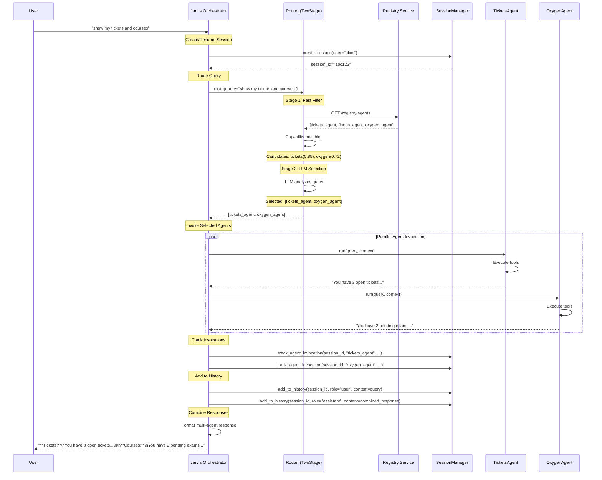
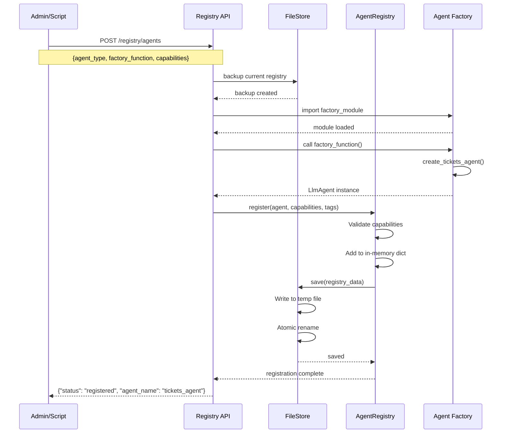
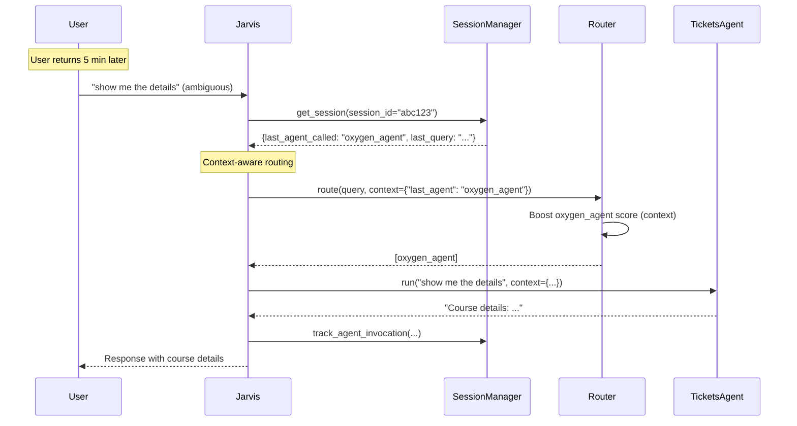

# Agent Registry Persistence - Technical Specification

## Executive Summary

This document specifies the implementation of a **persistent, production-ready agent registry system** with file-based agent metadata storage and SQLite session management. The system will be containerized for deployment.

**Status**: 🔴 Planning Phase - Awaiting Review
**Target**: Production-ready persistence layer for 100+ agents
**Effort**: ~3-4 days development + testing

---

## Table of Contents

1. [Architecture Overview](#architecture-overview)
2. [Directory Structure](#directory-structure)
3. [Component Design](#component-design)
4. [File Storage Format](#file-storage-format)
5. [Database Schema](#database-schema)
6. [API Design](#api-design)
7. [Call Flow & Sequence Diagrams](#call-flow--sequence-diagrams)
8. [Implementation Tasks](#implementation-tasks)
9. [Critical Challenges](#critical-challenges)
10. [Testing Strategy](#testing-strategy)

---

## 1. Architecture Overview

### Current State (In-Memory Only)
```
┌─────────────────────────────────────┐
│  AgentRegistry (In-Memory Dict)     │  ❌ Lost on restart
│  - agents: Dict[str, RegisteredAgent]│  ❌ No audit trail
└─────────────────────────────────────┘  ❌ No multi-instance support
```

### Target State (Persistent)
```
┌──────────────────────────────────────────────────────────────┐
│                    Agent Registry Service                     │
│                   (Dockerized, Port 8003)                     │
├──────────────────────────────────────────────────────────────┤
│                                                               │
│  ┌─────────────────────┐      ┌─────────────────────┐       │
│  │  AgentRegistry      │      │  SessionManager     │       │
│  │  (Core Logic)       │      │  (ADK Integration)  │       │
│  └──────┬──────────────┘      └──────┬──────────────┘       │
│         │                              │                      │
│  ┌──────▼──────────────┐      ┌──────▼──────────────┐       │
│  │  FileStore          │      │  SQLite DB          │       │
│  │  registry_config.json│     │  sessions.db        │       │
│  │  - Agent metadata   │      │  - Session data     │       │
│  │  - Capabilities     │      │  - Agent invocations│       │
│  │  - Tags, priority   │      │  - Conversation hist│       │
│  └─────────────────────┘      └─────────────────────┘       │
│                                                               │
└──────────────────────────────────────────────────────────────┘
           ▲                              ▲
           │                              │
           │ REST API (CRUD)              │ Session API
           │                              │
┌──────────┴──────────────────────────────┴──────────────┐
│              Jarvis Root Orchestrator                   │
│              (Uses registry for routing)                │
└─────────────────────────────────────────────────────────┘
```

### Key Benefits
✅ **Survives Restarts** - Registry state persisted to disk
✅ **Audit Trail** - Track when agents added/modified/deleted
✅ **Horizontal Scaling** - Multiple instances can share registry (future: use shared storage)
✅ **Version Control** - JSON config can be committed to Git
✅ **Hot Reload** - Add agents without full restart

---

## 2. Directory Structure

### New Structure
```
agentic_jarvis/
├── agent_registry_service/          # NEW: Isolated service
│   ├── __init__.py
│   ├── app.py                        # FastAPI application
│   ├── models.py                     # Data models
│   ├── registry/                     # Core registry logic
│   │   ├── __init__.py
│   │   ├── agent_registry.py         # From jarvis_agent/ (refactored)
│   │   ├── file_store.py             # NEW: File persistence
│   │   └── validator.py              # NEW: Schema validation
│   ├── sessions/                     # Session management
│   │   ├── __init__.py
│   │   ├── session_manager.py        # NEW: SQLite session mgmt
│   │   └── session_store.py          # NEW: DB operations
│   ├── api/                          # REST API
│   │   ├── __init__.py
│   │   ├── registry_routes.py        # CRUD endpoints
│   │   └── session_routes.py         # Session endpoints
│   ├── config/
│   │   └── default_registry.yaml     # Default agents config
│   ├── data/                         # Runtime data
│   │   ├── registry_config.json      # Live registry state
│   │   └── sessions.db               # SQLite database
│   ├── Dockerfile                    # Container definition
│   ├── requirements.txt              # Dependencies
│   └── tests/
│       ├── test_registry.py
│       ├── test_persistence.py
│       └── test_sessions.py
│
├── jarvis_agent/                     # Existing code
│   ├── agent_registry.py             # MOVED to agent_registry_service/
│   ├── dynamic_router.py             # UPDATED: use registry API
│   └── ...
│
├── scripts/
│   └── start_registry_service.sh     # NEW: Start registry service
│
└── docs/
    ├── AGENT_REGISTRY_PERSISTENCE_SPEC.md  # This file
    └── AGENT_REGISTRY_API.md         # NEW: API documentation
```

### File Locations
```
agent_registry_service/data/
├── registry_config.json          # Agent metadata (version controlled)
├── registry_config.backup.json   # Auto-backup before changes
└── sessions.db                   # Session data (not in Git)
```

---

## 3. Component Design

### 3.1 FileStore (Agent Registry Persistence)

**Purpose**: Persist agent metadata to JSON file with atomic writes and backups.

```python
# agent_registry_service/registry/file_store.py

class FileStore:
    """
    File-based persistence for agent registry.

    Features:
    - Atomic writes (write to temp, then rename)
    - Auto-backup before modifications
    - Schema validation on load
    - Thread-safe operations
    """

    def __init__(self, config_path: str = "data/registry_config.json"):
        self.config_path = Path(config_path)
        self.backup_path = Path(f"{config_path}.backup")
        self.lock = threading.Lock()

    def save(self, registry_data: Dict) -> bool:
        """Save registry to file with backup."""

    def load(self) -> Dict:
        """Load registry from file with validation."""

    def backup(self) -> bool:
        """Create backup of current registry."""

    def restore_from_backup(self) -> bool:
        """Restore from last backup."""
```

**File Format** (see Section 4)

---

### 3.2 SessionManager (SQLite Session Persistence)

**Purpose**: Store conversation sessions, agent invocations, and routing history.

```python
# agent_registry_service/sessions/session_manager.py

class SessionManager:
    """
    SQLite-based session management.

    Integrates with ADK's session service pattern while adding:
    - Agent invocation tracking
    - Routing history
    - User context
    """

    def __init__(self, db_path: str = "data/sessions.db"):
        self.db_path = db_path
        self.conn = sqlite3.connect(db_path, check_same_thread=False)
        self._init_schema()

    def create_session(self, user: str) -> str:
        """Create new session, return session_id."""

    def get_session(self, session_id: str) -> Optional[Dict]:
        """Get session with full history."""

    def track_agent_invocation(
        self,
        session_id: str,
        agent_name: str,
        query: str,
        response: str
    ):
        """Track which agent was called and what happened."""

    def get_agent_invocations(self, session_id: str) -> List[Dict]:
        """Get all agent calls in this session."""

    def add_to_history(self, session_id: str, role: str, content: str):
        """Add message to conversation history."""
```

**Database Schema** (see Section 5)

---

### 3.3 AgentRegistry (Enhanced)

**Purpose**: Core registry logic with persistence integration.

```python
# agent_registry_service/registry/agent_registry.py

class PersistentAgentRegistry(AgentRegistry):
    """
    Enhanced AgentRegistry with file-based persistence.

    Extends the original in-memory registry with:
    - Auto-save on modifications
    - Load from file on startup
    - Validation and rollback
    """

    def __init__(self, file_store: FileStore):
        super().__init__()
        self.file_store = file_store
        self._load_from_file()

    def register(self, agent, capabilities, tags=None):
        """Register agent and save to file."""
        super().register(agent, capabilities, tags)
        self._persist()

    def unregister(self, agent_name: str) -> bool:
        """Unregister agent and update file."""
        result = super().unregister(agent_name)
        if result:
            self._persist()
        return result

    def update_capabilities(
        self,
        agent_name: str,
        capabilities: AgentCapability
    ) -> bool:
        """Update agent capabilities and persist."""

    def _persist(self):
        """Save current state to file."""
        registry_data = self._serialize_registry()
        self.file_store.save(registry_data)

    def _load_from_file(self):
        """Load registry state from file."""
        data = self.file_store.load()
        self._deserialize_registry(data)

    def _serialize_registry(self) -> Dict:
        """Convert registry to JSON-serializable format."""
        # Agent instances can't be serialized
        # Store metadata only, recreate agents on load

    def _deserialize_registry(self, data: Dict):
        """Reconstruct registry from saved data."""
        # Problem: Can't recreate LlmAgent instances from JSON
        # Solution: Store agent factory functions or config
```

**🚨 CRITICAL CHALLENGE**: Agent instances (`LlmAgent`) cannot be directly serialized to JSON. See Section 9.1 for solutions.

---

### 3.4 REST API (FastAPI)

**Purpose**: Expose registry operations via HTTP for external management.

```python
# agent_registry_service/app.py

from fastapi import FastAPI, HTTPException
from .api import registry_routes, session_routes

app = FastAPI(title="Agent Registry Service", version="1.0.0")

app.include_router(registry_routes.router, prefix="/registry", tags=["registry"])
app.include_router(session_routes.router, prefix="/sessions", tags=["sessions"])

@app.get("/health")
def health_check():
    return {"status": "healthy", "service": "agent-registry"}

@app.on_event("startup")
async def startup():
    # Load registry from file
    # Initialize database
    pass
```

**API Endpoints** (see Section 6)

---

## 4. File Storage Format

### registry_config.json

```json
{
  "version": "1.0.0",
  "last_updated": "2025-12-26T10:30:00Z",
  "agents": {
    "tickets_agent": {
      "name": "tickets_agent",
      "description": "Handles IT operations tickets",
      "agent_type": "tickets",
      "factory_function": "create_tickets_agent",
      "factory_module": "jarvis_agent.mcp_agents.agent_factory",
      "capabilities": {
        "domains": ["tickets", "IT", "operations"],
        "operations": ["create", "read", "update", "list"],
        "entities": ["ticket", "request", "vpn", "gitlab"],
        "keywords": ["ticket", "IT", "operation"],
        "examples": [
          "show my tickets",
          "create a ticket for VPN access"
        ],
        "requires_auth": false,
        "priority": 10
      },
      "tags": ["production", "core"],
      "enabled": true,
      "registered_at": "2025-12-26T09:00:00Z",
      "metadata": {
        "version": "1.0",
        "owner": "IT-team",
        "sla_ms": 2000
      }
    },
    "finops_agent": {
      "name": "finops_agent",
      "description": "Cloud cost analytics",
      "agent_type": "finops",
      "factory_function": "create_finops_agent",
      "factory_module": "jarvis_agent.mcp_agents.agent_factory",
      "capabilities": {
        "domains": ["finops", "costs", "cloud"],
        "operations": ["read", "analyze"],
        "entities": ["cost", "budget", "aws", "gcp"],
        "keywords": ["cost", "spending", "cloud"],
        "examples": ["what are our cloud costs?"],
        "requires_auth": false,
        "priority": 10
      },
      "tags": ["production", "core"],
      "enabled": true,
      "registered_at": "2025-12-26T09:00:00Z",
      "metadata": {
        "version": "1.0",
        "owner": "FinOps-team"
      }
    }
  },
  "statistics": {
    "total_agents": 2,
    "enabled_agents": 2,
    "agents_by_tag": {
      "production": 2,
      "core": 2
    }
  }
}
```

### Key Design Decisions

1. **Store Factory Functions, Not Agent Instances**
   - Agent instances can't be serialized
   - Instead, store `factory_function` and `factory_module`
   - On load, dynamically import and call factory to recreate agents

2. **Metadata Separation**
   - Capabilities, tags, enabled status → Persisted
   - Agent instance, tools, instruction → Recreated from factory

3. **Versioning**
   - Schema version for migrations
   - Per-agent version for rollbacks

---

## 5. Database Schema

### SQLite Schema (sessions.db)

```sql
-- Sessions table
CREATE TABLE sessions (
    session_id TEXT PRIMARY KEY,
    user_id TEXT NOT NULL,
    created_at TIMESTAMP DEFAULT CURRENT_TIMESTAMP,
    updated_at TIMESTAMP DEFAULT CURRENT_TIMESTAMP,
    status TEXT DEFAULT 'active',  -- active, completed, expired
    metadata TEXT,  -- JSON blob for custom data
    UNIQUE(session_id)
);

CREATE INDEX idx_sessions_user ON sessions(user_id);
CREATE INDEX idx_sessions_created ON sessions(created_at);

-- Conversation history table
CREATE TABLE conversation_history (
    id INTEGER PRIMARY KEY AUTOINCREMENT,
    session_id TEXT NOT NULL,
    role TEXT NOT NULL,  -- user, assistant, system
    content TEXT NOT NULL,
    timestamp TIMESTAMP DEFAULT CURRENT_TIMESTAMP,
    FOREIGN KEY (session_id) REFERENCES sessions(session_id) ON DELETE CASCADE
);

CREATE INDEX idx_history_session ON conversation_history(session_id);

-- Agent invocations table
CREATE TABLE agent_invocations (
    id INTEGER PRIMARY KEY AUTOINCREMENT,
    session_id TEXT NOT NULL,
    agent_name TEXT NOT NULL,
    query TEXT NOT NULL,
    response TEXT,
    success BOOLEAN DEFAULT 1,
    error_message TEXT,
    duration_ms INTEGER,
    timestamp TIMESTAMP DEFAULT CURRENT_TIMESTAMP,
    FOREIGN KEY (session_id) REFERENCES sessions(session_id) ON DELETE CASCADE
);

CREATE INDEX idx_invocations_session ON agent_invocations(session_id);
CREATE INDEX idx_invocations_agent ON agent_invocations(agent_name);

-- Last agent per session (for context continuity)
CREATE TABLE session_context (
    session_id TEXT PRIMARY KEY,
    last_agent_called TEXT,
    last_query TEXT,
    last_response TEXT,
    updated_at TIMESTAMP DEFAULT CURRENT_TIMESTAMP,
    FOREIGN KEY (session_id) REFERENCES sessions(session_id) ON DELETE CASCADE
);
```

### Sample Session Data

```python
{
    "session_id": "abc123",
    "user_id": "alice",
    "created_at": "2025-12-26T10:00:00",
    "status": "active",
    "conversation_history": [
        {"role": "user", "content": "show my tickets", "timestamp": "..."},
        {"role": "assistant", "content": "You have 3 open tickets...", "timestamp": "..."}
    ],
    "agents_invoked": [
        {
            "agent_name": "tickets_agent",
            "query": "show my tickets",
            "response": "You have 3 tickets...",
            "success": true,
            "duration_ms": 245,
            "timestamp": "2025-12-26T10:00:05"
        }
    ],
    "last_agent_called": "tickets_agent"
}
```

---

## 6. API Design

### 6.1 Registry Management API

#### List All Agents
```http
GET /registry/agents
Response: {
  "agents": [
    {"name": "tickets_agent", "enabled": true, "tags": ["production"]},
    {"name": "finops_agent", "enabled": true, "tags": ["production"]}
  ],
  "total": 2
}
```

#### Get Agent Details
```http
GET /registry/agents/{agent_name}
Response: {
  "name": "tickets_agent",
  "description": "...",
  "capabilities": {...},
  "tags": ["production"],
  "enabled": true,
  "registered_at": "..."
}
```

#### Register New Agent
```http
POST /registry/agents
Body: {
  "agent_type": "tickets",
  "factory_function": "create_tickets_agent",
  "factory_module": "jarvis_agent.mcp_agents.agent_factory",
  "capabilities": {...},
  "tags": ["production"]
}
Response: {"status": "registered", "agent_name": "tickets_agent"}
```

#### Update Agent Capabilities
```http
PUT /registry/agents/{agent_name}/capabilities
Body: {
  "capabilities": {
    "domains": ["tickets", "IT", "operations", "security"],
    "priority": 15
  }
}
Response: {"status": "updated"}
```

#### Enable/Disable Agent
```http
PATCH /registry/agents/{agent_name}/status
Body: {"enabled": false}
Response: {"status": "disabled"}
```

#### Delete Agent
```http
DELETE /registry/agents/{agent_name}
Response: {"status": "deleted"}
```

#### Export Registry
```http
GET /registry/export
Response: {full registry JSON}
```

---

### 6.2 Session Management API

#### Create Session
```http
POST /sessions
Body: {"user_id": "alice"}
Response: {"session_id": "abc123"}
```

#### Get Session
```http
GET /sessions/{session_id}
Response: {
  "session_id": "abc123",
  "user_id": "alice",
  "conversation_history": [...],
  "agents_invoked": [...],
  "last_agent_called": "tickets_agent"
}
```

#### Track Agent Invocation
```http
POST /sessions/{session_id}/invocations
Body: {
  "agent_name": "tickets_agent",
  "query": "show my tickets",
  "response": "You have 3 tickets...",
  "success": true,
  "duration_ms": 245
}
Response: {"status": "tracked"}
```

#### Add to Conversation History
```http
POST /sessions/{session_id}/history
Body: {
  "role": "user",
  "content": "show my tickets"
}
Response: {"status": "added"}
```

---

## 7. Call Flow & Sequence Diagrams

### 7.1 System Startup Flow

```
1. Start Agent Registry Service
   ├── Load registry_config.json
   ├── Validate schema
   ├── For each agent in config:
   │   ├── Import factory module
   │   ├── Call factory function
   │   ├── Create LlmAgent instance
   │   └── Register in memory with capabilities
   ├── Initialize SQLite database
   ├── Start FastAPI server on port 8003
   └── Ready to serve requests

2. Start Jarvis Orchestrator
   ├── Connect to Registry Service (http://localhost:8003)
   ├── Fetch available agents
   ├── Initialize TwoStageRouter
   └── Ready to route queries
```

---

### 7.2 User Query Flow (Detailed)



---

### 7.3 Agent Registration Flow



---

### 7.4 Session Continuation Flow



---

## 8. Implementation Tasks

### Phase 1: Core Persistence (Priority 1)

#### Task 1.1: File Storage Implementation
**File**: `agent_registry_service/registry/file_store.py`
**Effort**: 4-6 hours
**Dependencies**: None

```python
# Implement:
- FileStore class
- Atomic write with temp file
- Auto-backup before modifications
- Schema validation
- Error handling and rollback
- Thread-safe operations

# Tests:
- test_save_and_load()
- test_atomic_write()
- test_backup_and_restore()
- test_corrupted_file_handling()
- test_concurrent_writes()
```

**Critical**: Must handle corrupted files gracefully.

---

#### Task 1.2: Enhanced AgentRegistry
**File**: `agent_registry_service/registry/agent_registry.py`
**Effort**: 6-8 hours
**Dependencies**: Task 1.1

```python
# Implement:
- PersistentAgentRegistry class
- _serialize_registry() - Convert to JSON
- _deserialize_registry() - Rebuild from JSON
- Auto-persist on register/unregister/update
- Factory function resolver

# CRITICAL CHALLENGE:
# LlmAgent instances can't be serialized
# Solution: Store factory function + module, recreate on load

# Tests:
- test_persist_and_reload()
- test_agent_recreation_from_factory()
- test_update_capabilities()
- test_rollback_on_error()
```

**Blocker**: Need to design agent factory pattern.

---

#### Task 1.3: Agent Factory Pattern
**File**: `agent_registry_service/registry/agent_factory_resolver.py`
**Effort**: 4-6 hours
**Dependencies**: None

```python
# Implement:
class AgentFactoryResolver:
    """
    Resolves agent factory functions from config.

    Example:
        resolver.create_agent({
            "factory_module": "jarvis_agent.mcp_agents.agent_factory",
            "factory_function": "create_tickets_agent"
        })
        # Returns: LlmAgent instance
    """

    def create_agent(self, agent_config: Dict) -> LlmAgent:
        # Import module dynamically
        # Call factory function
        # Return agent instance

# Tests:
- test_resolve_factory()
- test_invalid_module()
- test_invalid_function()
- test_factory_with_parameters()
```

---

### Phase 2: Session Management (Priority 1)

#### Task 2.1: SQLite Schema Setup
**File**: `agent_registry_service/sessions/schema.sql`
**Effort**: 2-3 hours
**Dependencies**: None

```sql
-- Implement tables:
- sessions
- conversation_history
- agent_invocations
- session_context

-- Add indexes for performance
-- Add foreign keys for referential integrity
```

---

#### Task 2.2: SessionManager Implementation
**File**: `agent_registry_service/sessions/session_manager.py`
**Effort**: 8-10 hours
**Dependencies**: Task 2.1

```python
# Implement:
- SessionManager class
- create_session()
- get_session()
- track_agent_invocation()
- add_to_history()
- get_agent_invocations()
- session cleanup (expire old sessions)

# Tests:
- test_create_and_retrieve_session()
- test_track_invocations()
- test_conversation_history()
- test_concurrent_sessions()
- test_session_cleanup()
```

---

### Phase 3: REST API (Priority 2)

#### Task 3.1: Registry CRUD Endpoints
**File**: `agent_registry_service/api/registry_routes.py`
**Effort**: 6-8 hours
**Dependencies**: Task 1.2

```python
# Implement:
- GET /registry/agents
- GET /registry/agents/{name}
- POST /registry/agents
- PUT /registry/agents/{name}/capabilities
- PATCH /registry/agents/{name}/status
- DELETE /registry/agents/{name}
- GET /registry/export

# Include:
- Input validation with Pydantic
- Error handling
- OpenAPI docs
- Rate limiting (future)
```

---

#### Task 3.2: Session API Endpoints
**File**: `agent_registry_service/api/session_routes.py`
**Effort**: 4-6 hours
**Dependencies**: Task 2.2

```python
# Implement:
- POST /sessions
- GET /sessions/{id}
- POST /sessions/{id}/invocations
- POST /sessions/{id}/history
- DELETE /sessions/{id}
```

---

### Phase 4: Integration & Deployment (Priority 2)

#### Task 4.1: Dockerization
**File**: `agent_registry_service/Dockerfile`
**Effort**: 3-4 hours
**Dependencies**: All above

```dockerfile
FROM python:3.11-slim

WORKDIR /app

COPY requirements.txt .
RUN pip install --no-cache-dir -r requirements.txt

COPY . .

# Create data directories
RUN mkdir -p /app/data

EXPOSE 8003

CMD ["uvicorn", "app:app", "--host", "0.0.0.0", "--port", "8003"]
```

---

#### Task 4.2: Update Jarvis Orchestrator
**File**: `jarvis_agent/dynamic_router.py`, `main_mcp_auth.py`
**Effort**: 4-6 hours
**Dependencies**: Task 3.1

```python
# Changes:
1. Router connects to Registry Service API instead of in-memory registry
2. SessionManager integrated into ADK runner
3. Track agent invocations after each call
4. Load agents from registry service on startup

# Update imports:
- Remove: from jarvis_agent.agent_registry import AgentRegistry
- Add: from agent_registry_service.client import RegistryClient
```

---

#### Task 4.3: Startup Scripts
**File**: `scripts/start_registry_service.sh`
**Effort**: 1-2 hours
**Dependencies**: Task 4.1

```bash
#!/bin/bash
cd agent_registry_service
uvicorn app:app --host 0.0.0.0 --port 8003 --reload
```

---

### Phase 5: Testing & Documentation (Priority 3)

#### Task 5.1: Integration Tests
**Effort**: 6-8 hours
**Dependencies**: All implementation tasks

```python
# Test scenarios:
1. Full startup → register agents → route query → track session
2. Agent modification → persist → restart → verify changes
3. Multi-user concurrent sessions
4. Agent hot-reload without restart
5. Failure scenarios (DB corruption, file lock, etc.)
```

---

#### Task 5.2: API Documentation
**File**: `docs/AGENT_REGISTRY_API.md`
**Effort**: 3-4 hours
**Dependencies**: Task 3.1, 3.2

```markdown
# Document:
- All API endpoints with examples
- Request/response schemas
- Error codes and handling
- Authentication (future)
- Rate limits (future)
```

---

## 9. Critical Challenges

### 9.1 Agent Serialization Problem

**Problem**: `LlmAgent` instances cannot be directly serialized to JSON.

**Why**:
```python
agent = LlmAgent(
    name="tickets_agent",
    instruction="...",
    tools=[tool1, tool2],  # Function objects
    sub_agents=[...]       # Other LlmAgent instances
)

# Can't do this:
json.dumps(agent)  # TypeError: LlmAgent is not JSON serializable
```

**Solution**: Store factory function references, not instances.

```json
{
  "agent_type": "tickets",
  "factory_module": "jarvis_agent.mcp_agents.agent_factory",
  "factory_function": "create_tickets_agent",
  "factory_params": {}  # Optional parameters
}
```

On load:
```python
import importlib

module = importlib.import_module("jarvis_agent.mcp_agents.agent_factory")
factory = getattr(module, "create_tickets_agent")
agent = factory()  # Recreate agent
```

**Trade-off**: Agents must have factory functions. Can't persist ad-hoc agents created inline.

---

### 9.2 Multi-Instance Registry Consistency

**Problem**: If you run 2+ instances of Jarvis, each has its own file.

**Current Solution**: Share filesystem (NFS, EFS) or use distributed config.

**Future**: Replace file storage with Redis/PostgreSQL for multi-instance deployments.

**For Now**: Single instance deployment only.

---

### 9.3 Agent Code Changes

**Problem**: What if agent factory function changes (new parameters, different tools)?

**Scenario**:
```python
# Version 1
def create_tickets_agent():
    return LlmAgent(name="tickets", tools=[tool1, tool2])

# Version 2 (new tool added)
def create_tickets_agent():
    return LlmAgent(name="tickets", tools=[tool1, tool2, tool3])
```

Registry config is stale after code update.

**Solution**:
1. **Schema versioning** - Track agent version in config
2. **Auto-reload** - Detect code changes, recreate agents
3. **Manual sync** - Admin updates registry via API after code deploy

**Recommended**: Auto-reload on startup (always recreate from latest code).

---

### 9.4 Database Migrations

**Problem**: Schema changes require migrations.

**Solution**: Use Alembic for SQLite migrations.

```bash
# Add migration
alembic revision --autogenerate -m "add user_preferences table"

# Apply migration
alembic upgrade head
```

**For v1.0**: Schema is stable, migrations not critical yet.

---

### 9.5 Session Cleanup

**Problem**: Sessions accumulate indefinitely, DB grows.

**Solution**: Background job to cleanup old sessions.

```python
# Cron job or background task
def cleanup_old_sessions():
    # Delete sessions older than 7 days with status='completed'
    # Delete sessions older than 30 days regardless of status
    conn.execute("""
        DELETE FROM sessions
        WHERE status='completed' AND created_at < datetime('now', '-7 days')
    """)
```

**Recommended**: Run daily at 2 AM.

---

## 10. Testing Strategy

### 10.1 Unit Tests

```python
# test_file_store.py
- Save and load registry
- Atomic writes
- Backup/restore
- Concurrent access
- Corrupted file handling

# test_agent_registry.py
- Register/unregister agents
- Update capabilities
- Enable/disable agents
- Persistence across reload

# test_session_manager.py
- Create/retrieve sessions
- Track invocations
- Conversation history
- Session cleanup
```

---

### 10.2 Integration Tests

```python
# test_full_flow.py
def test_complete_user_journey():
    # 1. Start registry service
    # 2. Register 3 agents
    # 3. Restart service
    # 4. Verify agents still registered
    # 5. Create session
    # 6. Route query → multi-agent response
    # 7. Track invocations
    # 8. Verify session state
    # 9. Continue conversation
    # 10. Cleanup
```

---

### 10.3 Performance Tests

```python
# test_performance.py
def test_registry_with_100_agents():
    # Register 100 agents
    # Measure:
    # - Registration time
    # - Query routing time (Stage 1 + 2)
    # - File save time
    # Assert: < 500ms per query

def test_concurrent_sessions():
    # Create 50 concurrent sessions
    # Each makes 10 queries
    # Verify no data corruption
```

---

### 10.4 Failure Tests

```python
# test_failures.py
def test_db_corruption():
    # Corrupt sessions.db
    # Verify graceful degradation
    # Recreate from scratch

def test_file_lock():
    # Simulate file lock (another process)
    # Verify retry logic

def test_factory_import_error():
    # Invalid factory module
    # Verify error handling
```

---

## 11. Deployment Checklist

### Pre-Deployment

- [ ] All tests pass (unit + integration)
- [ ] Docker image builds successfully
- [ ] Default registry config exists
- [ ] Database schema initialized
- [ ] Backup strategy defined
- [ ] Monitoring/logging configured

### Deployment Steps

1. **Build Docker image**
   ```bash
   cd agent_registry_service
   docker build -t agent-registry:1.0.0 .
   ```

2. **Initialize data directory**
   ```bash
   mkdir -p /data/agent_registry
   cp config/default_registry.yaml /data/agent_registry/
   ```

3. **Start service**
   ```bash
   docker run -d \
     -p 8003:8003 \
     -v /data/agent_registry:/app/data \
     --name agent-registry \
     agent-registry:1.0.0
   ```

4. **Verify health**
   ```bash
   curl http://localhost:8003/health
   ```

5. **Register agents**
   ```bash
   python scripts/register_default_agents.py
   ```

6. **Update Jarvis to use registry**
   - Update environment: `REGISTRY_SERVICE_URL=http://localhost:8003`
   - Restart Jarvis

---

## 12. Future Enhancements

### Phase 2 Improvements

1. **Authentication**
   - API key for registry modifications
   - JWT for session access
   - RBAC (admin, read-only)

2. **Distributed Registry**
   - Redis backend for multi-instance
   - Registry replication
   - Consul for service discovery

3. **Advanced Features**
   - Agent versioning and rollback
   - A/B testing (route 10% to beta agent)
   - Agent health checks and auto-disable
   - Metrics and observability

4. **Performance**
   - Redis cache for hot agents
   - Lazy agent loading
   - Batch registration API

---

## 13. Summary & Timeline

### Estimated Timeline

| Phase | Tasks | Effort | Dependencies |
|-------|-------|--------|--------------|
| Phase 1 | File Storage + Enhanced Registry | 14-20 hours | None |
| Phase 2 | Session Management | 10-13 hours | None |
| Phase 3 | REST API | 10-14 hours | Phase 1, 2 |
| Phase 4 | Integration + Docker | 8-12 hours | Phase 3 |
| Phase 5 | Testing + Docs | 9-12 hours | All |
| **Total** | **All Tasks** | **51-71 hours** | **~2-3 weeks** |

### Resource Requirements

- **Developer**: 1 senior engineer (familiar with FastAPI, SQLite, Docker)
- **Infrastructure**: SQLite (included), Docker runtime
- **Storage**: ~10 MB for registry + ~100 MB per 10k sessions

---

## 14. Risks & Mitigation

| Risk | Impact | Probability | Mitigation |
|------|--------|-------------|------------|
| Agent serialization issues | High | Medium | Use factory pattern, extensive testing |
| Schema changes break compatibility | Medium | Low | Version schema, migrations |
| File corruption on crash | High | Low | Atomic writes, auto-backup |
| Performance degradation (100+ agents) | Medium | Medium | Profiling, caching, optimization |
| Multi-instance conflicts | High | Low | Document single-instance limitation |

---

## 15. Success Criteria

✅ **Must Have (MVP)**
1. Registry survives restarts
2. Agents can be registered/updated/deleted via API
3. Sessions persist to SQLite with full history
4. Agent invocations tracked per session
5. Docker deployment works
6. 90%+ test coverage

✅ **Should Have**
1. Auto-backup before modifications
2. Graceful error handling
3. API documentation
4. Performance: <500ms per query (100 agents)

✅ **Nice to Have**
1. Hot-reload agents without restart
2. Registry export/import
3. Session analytics dashboard

---

## Appendix A: Configuration Examples

### Environment Variables

```bash
# agent_registry_service/.env
REGISTRY_CONFIG_PATH=data/registry_config.json
SESSION_DB_PATH=data/sessions.db
LOG_LEVEL=INFO
PORT=8003
HOST=0.0.0.0
GOOGLE_API_KEY=your_key_here
```

### Default Registry Config

```yaml
# config/default_registry.yaml
version: "1.0.0"
agents:
  - name: tickets_agent
    factory_module: jarvis_agent.mcp_agents.agent_factory
    factory_function: create_tickets_agent
    capabilities:
      domains: [tickets, IT]
      operations: [create, read, update]
      entities: [ticket, vpn, gitlab]
      priority: 10
    tags: [production, core]
    enabled: true

  - name: finops_agent
    factory_module: jarvis_agent.mcp_agents.agent_factory
    factory_function: create_finops_agent
    capabilities:
      domains: [finops, costs]
      operations: [read, analyze]
      entities: [cost, budget, aws]
      priority: 10
    tags: [production, core]
    enabled: true
```

---

## Appendix B: Code Samples

### Registry Client for Jarvis

```python
# jarvis_agent/registry_client.py
import requests

class RegistryClient:
    """Client to interact with Agent Registry Service."""

    def __init__(self, base_url: str = "http://localhost:8003"):
        self.base_url = base_url

    def list_agents(self, enabled_only: bool = True) -> List[Dict]:
        """List all registered agents."""
        resp = requests.get(f"{self.base_url}/registry/agents")
        resp.raise_for_status()
        return resp.json()["agents"]

    def get_agent(self, agent_name: str) -> Dict:
        """Get specific agent details."""
        resp = requests.get(f"{self.base_url}/registry/agents/{agent_name}")
        resp.raise_for_status()
        return resp.json()
```

---

**END OF SPECIFICATION**

---

## Document Metadata

- **Version**: 1.0.0
- **Author**: Claude Code
- **Date**: 2025-12-26
- **Status**: 🔴 Draft - Awaiting Review
- **Review Required By**: @vishalkumar
- **Target Completion**: Week of 2025-12-30

---

## Review Checklist

- [ ] Architecture approved
- [ ] File storage format acceptable
- [ ] Database schema reviewed
- [ ] API design approved
- [ ] Timeline realistic
- [ ] Risks acknowledged
- [ ] Ready to proceed with implementation

---

**Please review this specification and provide feedback before implementation begins.**
